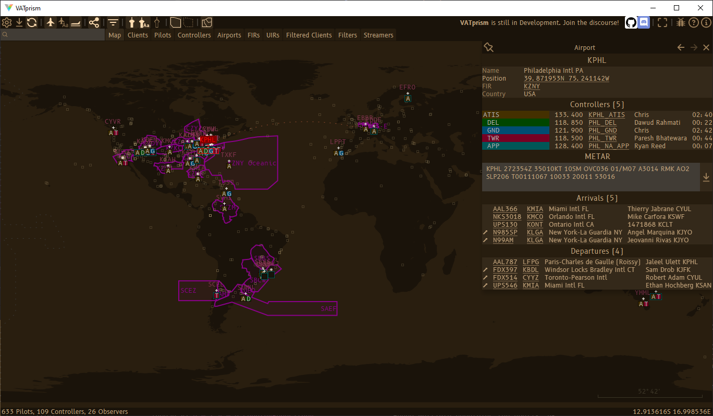
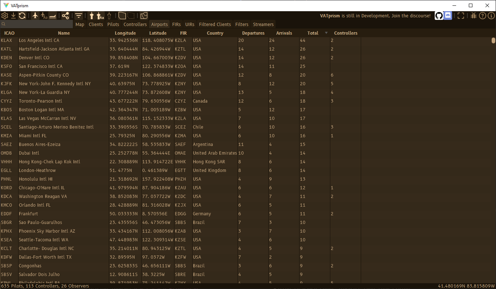
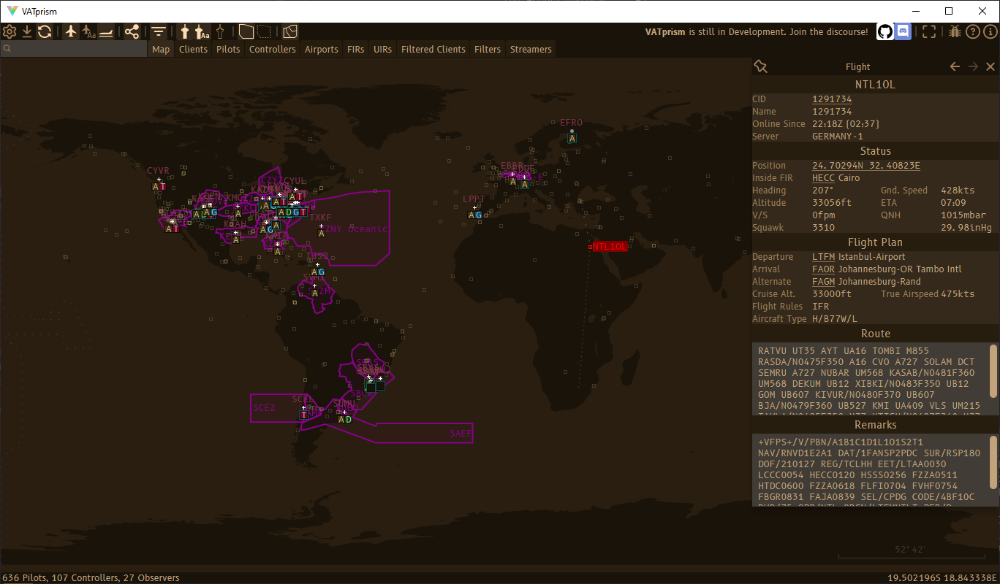
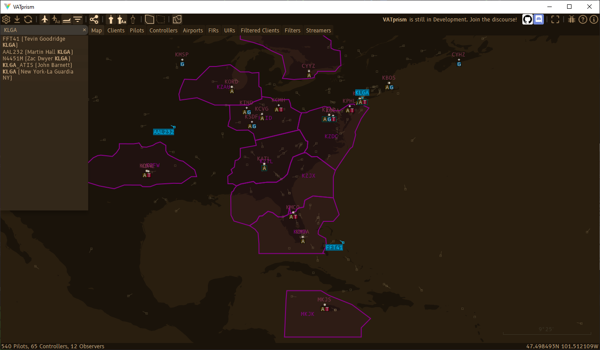
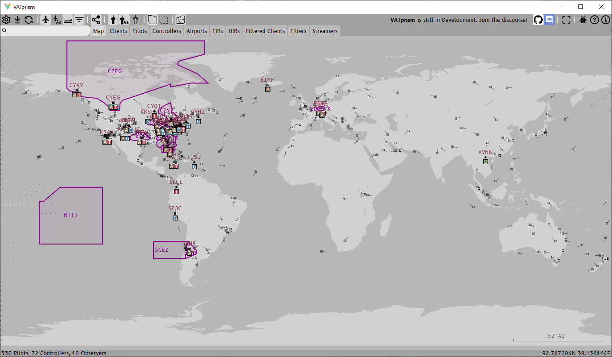

# VATprism    

Welcome to the VATprism repository! VATprism is a data explorer for [VATSIM](https://www.vatsim.net/), the
**V**irtual **A**ir **T**raffic **Sim**ulation Network. VATprism allows users to explore available ATC services,
connected pilots, Airports, Flight and Upper Information Regions and more!

## Motivation

VATprism was born out of a desire to simplify, and make more customizable, access to VATSIM data and is inspired by the
excellent [VAT-Spy](http://www1.metacraft.com/VATSpy/), which, as of this time, unfortunately remains closed source.

## Download

For instructions on how to download VATprism, see the [Installation](#installation) section of this readme.

## Screenshots

#### Airport Detail

#### Airport Table

#### Pilot Detail

#### Full text search!

#### Fully customizable!

More information can be found on [vatprism.org](https://vatprism.org/)

## Issues

Issue tracking takes place on this GitHub issue repository. You are most invited to contribute bugs, issues, feature or
any other constructive feedback [as an issue.](https://github.com/marvk/vatprism/issues) Before submitting an issue,
please check existing issues for duplicates.

## Installation

#### Windows

Simply download the latest installer (`.msi`) from
the [releases page](https://github.com/marvk/vatprism/releases/latest)
and run it. The installer will guide you through the installation.

Note: Windows Defender SmartScreen might show [a warning](docs/assets/images/warning.png) about the installer not being
a recognized app. This is harmless and simply an issue of the installer
being [unsigned.](https://docs.microsoft.com/en-us/windows/security/threat-protection/microsoft-defender-smartscreen/microsoft-defender-smartscreen-overview)

#### Linux and macOS

Currently, there is no support for native linux or macOS binaries. It is still possible to run VATprism with `java` by
downloading the `.jar` from the [releases page](https://github.com/marvk/vatprism/releases) and
running `java -jar vatprism-VERSION.jar`. This requires an installation of JDK 15+ or JRE 15+, which are available on
the [AdoptOpenJDK website.](https://adoptopenjdk.net/index.html)

If there is demand for macOS or Linux native binaries in the future, I will think about adding support. Feel free to
request [Linux](https://github.com/marvk/vatprism/issues/31) or [macOS](https://github.com/marvk/vatprism/issues/30)
builds via the linked issues.

## Build

Building the project requires the following tools:

* [Apache Maven](https://maven.apache.org/)

* [JDK 15+](https://adoptopenjdk.net/)

* [WiX Toolset](https://wixtoolset.org/) (For building a Windows Installer via `jpackage`)

To build the project, clone the repository and run `mvn package`. Currently, this will fail if WiX Toolkit is not
installed. To disable the Windows installer build, remove the Exec Maven Plugin from the `pom.xml`.

## Acknowledgements

VATprism uses the [VAT-Spy Client Data Update Project](https://github.com/vatsimnetwork/vatspy-data-project) as a source
of static data and the [VATSIM API](https://api.vatsim.net/api/) as a source of dynamic data.