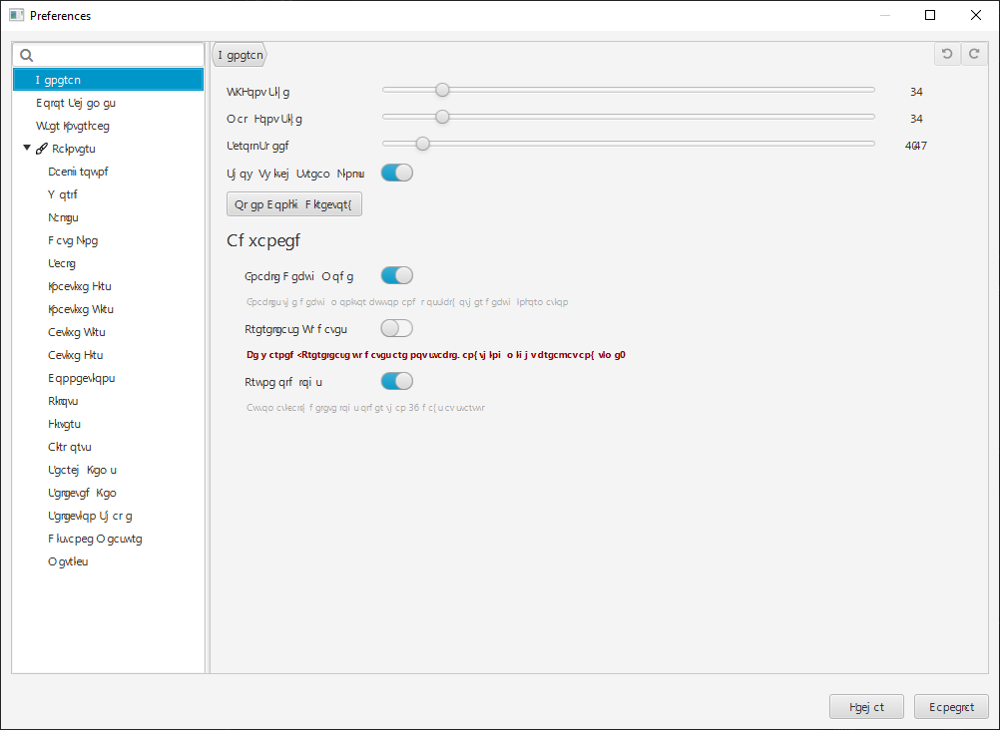

# Frequently Asked Questions

### [← back](/)

### Question:

Where does VATprism get its data from?

### Answer:

Data is fetched from [the VATSIM API](https://api.vatsim.net/api/). Static data like FIR-Boundaries are updated on every
startup and are sourced from
the [VAT-Spy Client Data Update Project](https://github.com/vatsimnetwork/vatspy-data-project).

---

### Question:

Why does the text in VATprism look all scrambled?

### Answer:

[This is most likely an issue with your Windows Fonts,](https://stackoverflow.com/a/66845136/3000387) more specifically
with a corrupted or missing Segoe UI font. To fix this issue, reinstall Segoe UI.

### [← back](/)