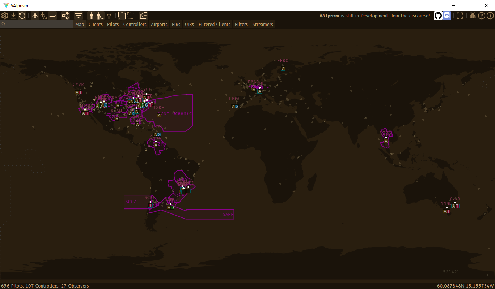
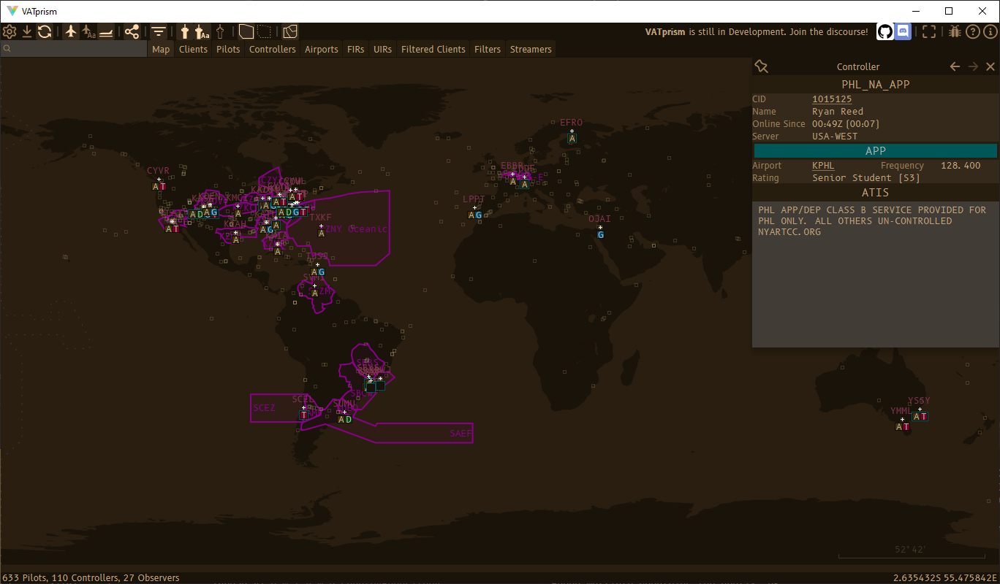
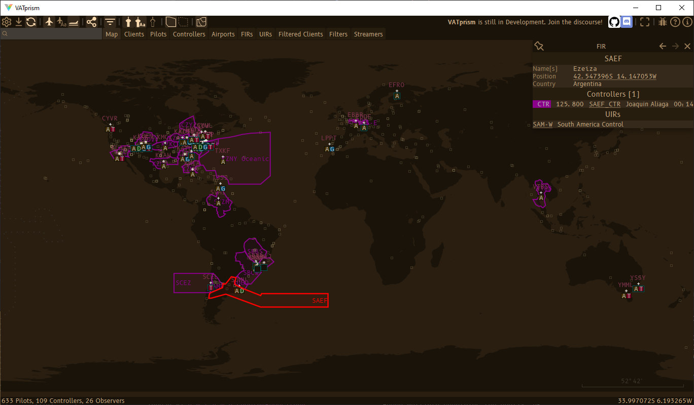
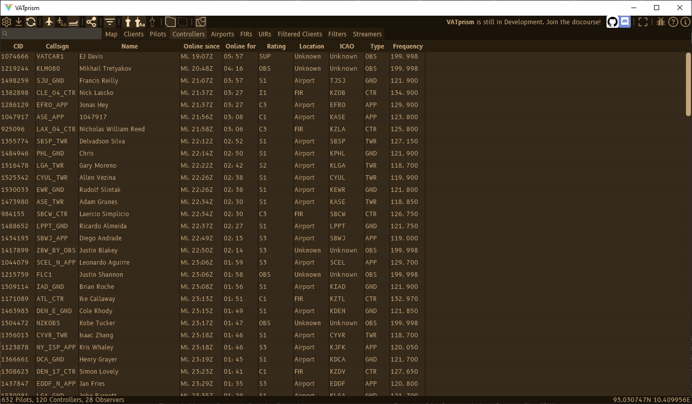
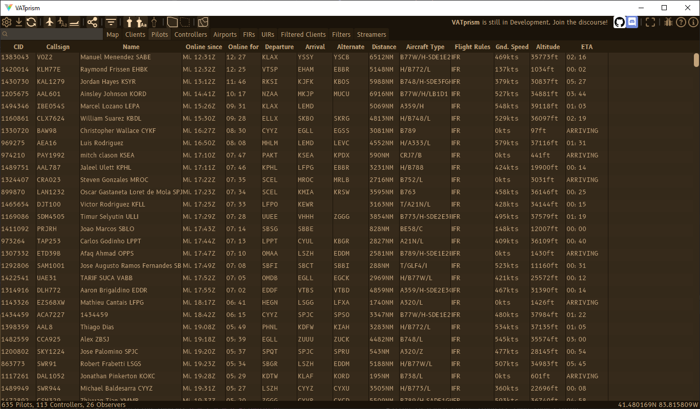
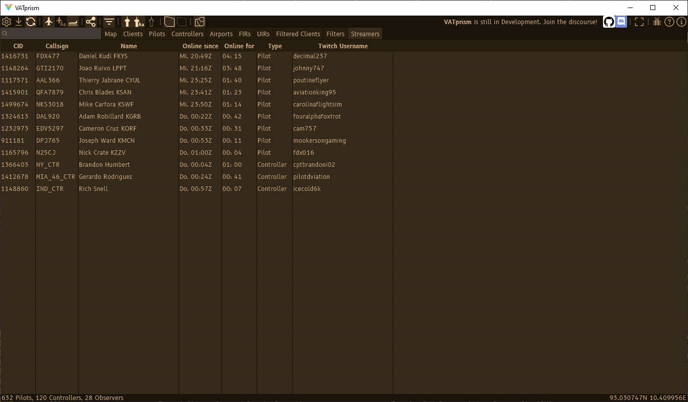
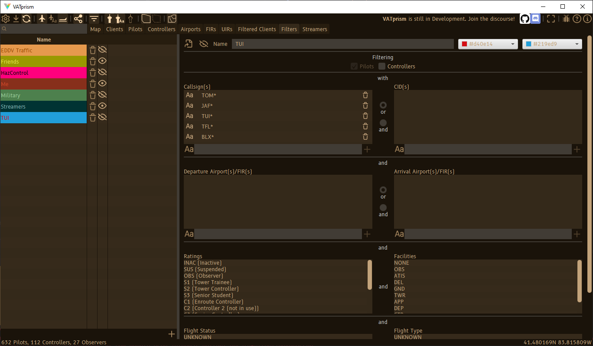
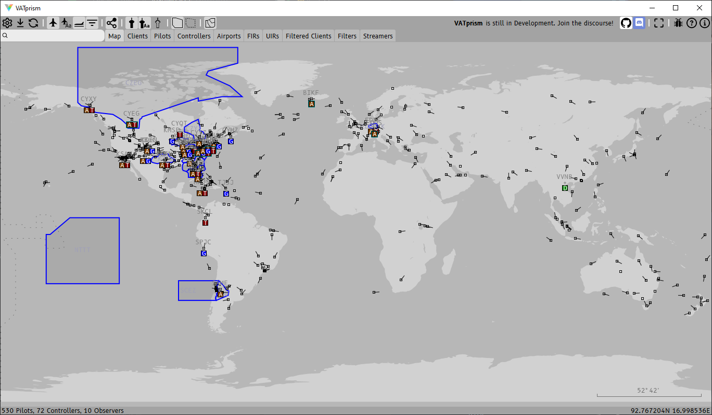
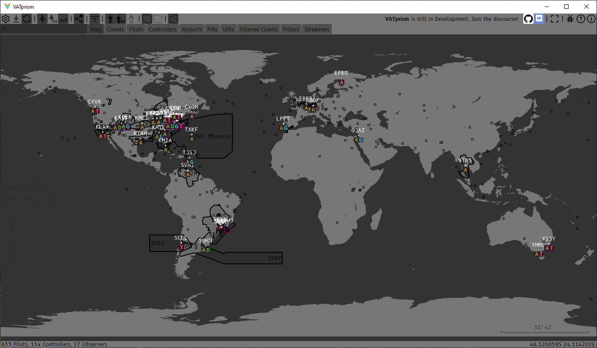
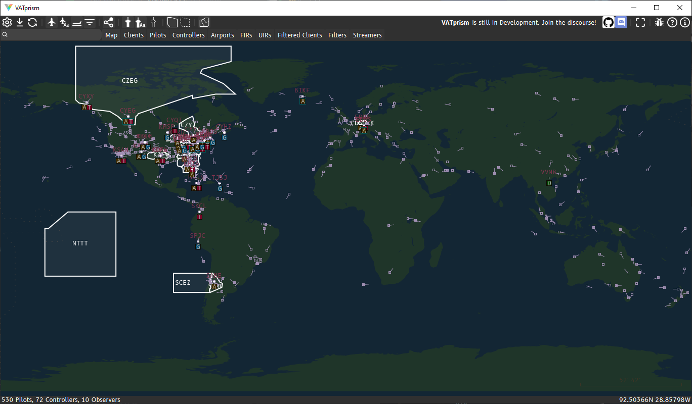

 

## Download

#### Latest: {{ site.github.releases[0].name }} ({{ site.github.releases[0].published_at }})

[Download Installer (Windows)]({{ site.github.releases[0].assets[2].browser_download_url }})

Note: Windows Defender SmartScreen might show [a warning](assets/images/warning.png) about the installer not being a
recognized app. This is harmless and simply an issue of the installer
being [unsigned.](https://docs.microsoft.com/en-us/windows/security/threat-protection/microsoft-defender-smartscreen/microsoft-defender-smartscreen-overview)

[Download Source]({{ site.github.zip_url }})

## Why VATprism?

VATprism has been build from the ground up to offer a no-fuss experience into the world of VATSIM data. VATprism makes
it easy to find Flights, Airports and other Data and navigate between that data. It offers fully customizable color
schemes, allowing you to adjust the interface colors to your liking. VATprism also allows you to create an unlimited
amount of filters, marking flights you are interested in with any color you prefer.

## Showcase

### Detail Views

VATprism allows you to simply click on any data displayed on the map: airports, flights, controllers and FIRs. This
brings up a detailed overview of the item that is easily navigable by clicking on any provided links.

#### Airports

See airport location, active controllers, metar, arrivals and departures!

#### Controllers

Displays controller information, location and their atis.

#### Pilots

See a pilots' information, location including vertical speed and ETA, and flight plan including route and remarks and if
they are streaming on Twitch.

#### FIRs

Quickly check all controllers assigned to the FIR, including better FIR matching for controller callsigns with infixes,
such as EDDG-E and EDDG-P.

### Tables

VATprism includes a number of tables showing all kinds of network data. Pilots, Controllers, Airports, FIRs, UIRs and
more!

#### Airports

Show all airports with the number of incoming and outgoing flights and number of connected controllers.

#### Controllers

See all controllers, including observers, with their location, rating and frequency.

#### Pilots

Lists all connected pilots with all kinds of data, including ETA, ground speed and altitude. Want to find the fastest or
highest plane on the network? The longest flight? The flight that has been connected the longest? No problem!

#### Streamers

Want to find a VATSIM stream to watch? This table lists all users that have included a link to their twitch stream in
their remarks. [Want to make sure you show up here when you're streaming?](/streamers)

#### Distance Measure

<video autoplay loop controls>
  <source src="assets/images/showcase/distance_measure.mp4" type="video/mp4">
Your browser does not support the video tag.
</video> 

Measure distance between any two positions on the map, with an optional approximate duration calculated from an
adjustable ground speed.

### Filters

Create an infinite amount of filters, filtering callsigns, CIDs, departure and arrival airports and much more, including
custom map colors. Filters are also disableable, and may be shared as a .json file.

### Color Schemes

VATprism allows you to customize every color drawn on the map individually. This gives you all the control you need to
customize the look of your VATprism map. Dark, light, colorful or muted, or anything in between. Anything is possible!

#### Longing for the true and trusted?

#### Can I HazControl?

#### Basically Google Maps.

