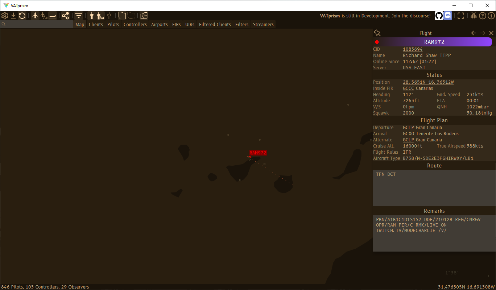

# Streamers

### [← back](/)

VATprism will show users which clients are streaming on Twitch.

#### Want to make sure you show up?

Simply put `twitch.tv/<your-username>` or `twitch.tv <your-username>` in your remarks and VATprism will automatically
add links to your Twitch stream to users clicking on you, and will add you to the streamers table.

### [← back](/)